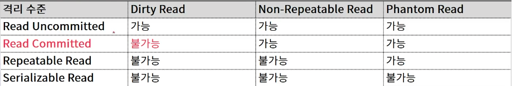

# 트랜잭션

### 트랜잭션이란?

데이터 베이스 관리 시스템 또는 유사한 시스템에서 상호작용의 단위이다. 

트랜잭션을 조작하는 기능은 사용자가 데이터베이스 완전성 유지를 확신하게 한다.  


### 트랜잭션의 4대 특징

1. 원자성(Atomicity)
2. 일관성(Consistency)
3. 고립성(Isolation)
4. 지속성(Durability)

#### 원자성

데이터 조작이 전부 성공 혹은 실패할지 보증하는 구조

#### 일관성

데이터 조작 전후에 일관성 유지 필요 

EX) 시스템에 사용자 등록 시 등록번호에 유일성 제약 설정

#### 고립성

복수 사용자가 동시에 데이터 조작 실행할 경우 각각의 처리가 모순 없이 실행되는 것을 보증

DBMS 내에서 트랜잭션 격리 수준 설정으로 구현

#### 지속성

트랜잭션이 Commit 되고 나면 데이터 변경 사항이 영구적으로 확정되는 것을 보장. 


### 트랜잭션 처리의 필요성

#### 원자성의 중요성

- 트랜잭션은 전부 성공하거나 혹은 전부 실패해야 한다. 
- 부분 성공이라는 단어는 절대로 존재하면 안됨.

#### 트랜잭션 고립성의 중요성


- 사용자 A가 선택한 좌석은 A가 선택한 좌석ㄱ을 취소할 때까지 다른 사용자가 선택할 수 없어야 한다.
- 만약 사용자 A가 선택한 좌석을 사용자 A가 결제완료까지 예매가 완료 되었는데 사용자 B 또한 사용자 A가 선택한 좌석을 결제완료까지 해서 예매를 완료한다면 영화관에서 해당 좌석이 누구인지에 대해서 싸움이 벌어질 것이다. 


### 트랜잭션 격리 수준

#### ANSI 표준 격리 수준

| 격리 수준        | 설명                                                         |
| ---------------- | ------------------------------------------------------------ |
| Read Uncommitted | commit 되지 않은 읽기<br /> 아직 commit 되지 않은 데이터를 다른 태랜잭션이 읽는 것을 허용 |
| Read Committed   | Commit된 읽기<br />트랜잭션이 Commit 확정된 데이터만 다른 트랜잭션이 읽도록 허용 |
| Repeatable Read  | 바복 읽기 <br />트랜잭션 내에서 쿼리를 두번 이상 수행할 때, 첫 번째 쿼리에 있던 레코드가 사라지거나 값이 바뀌는 현상을 방지 (lock) |
| Serializable     | 직렬화 가능<br />트랜잭션 내에서 쿼리를 두번 이상 수행할 때, 첫 번째 쿼리에 있던 레코드가 사라지거나 값이 바뀌지 않음은 물론 새로운 레코드가 나타나지도 않음 ( 어떤 작업 처리를 직렬화 하겠다. 다른 사람 못들어옴.) |

Serialzable 수준으로 DBMS 운영시 동시성이 크게 떨어지면서 성능 상 이슈가 발생

보통 Read Committed 필요한 경우에만 Repeatable Read로 사용한다. 



- durty read : 아직 commoit 되지 않은 값을 읽었는데 변경을 간한 트랜잭션이 최종적으로 롤백 된다면 그 값을 읽은 트랜잭션은 비 일관된 상태에 놓이게 됨
- non-repeatable read : 한 트랜잭션 내에서 같은 쿼리를 두번 수행했는데, 그 사이에 다른 트랜잭션이 값을 수정 또는 삭제하는 바람에 두 쿼리 결과가 다르게 나타나는 현상
- Phantom Read : 한 트랜잭션 내에서 같은 쿼리를 두번 수행했는데, 첫 번째 쿼리에서 없던 유령 레코드가 두 번째 쿼리에서 나타나는 현상

격리 수준을 바꾸는 방법

```sql
ALTER SESSION SET ISOLATION_LLEVEL = SERIALIZABLE;
```


### 락

#### 개념

1. 갱신손실 문제를 해결하려면 상대방 트랜잭션이 데이터를 사용하는지 여부를 알 수 있는 규칙이 푤요함.
2. 데이터를 수정 중이라는 사실을 알리는 방법의 장금 장치임

#### 유형

락은 트랜잭션이 읽기를 할 때 사용하는 락인 공유락과 읽고 쓰기를 할 때 사용하는 배타락 으로 나뉨. 

공유락 : 락을 걸어도 읽으 수는 있음.

배타락 : 읽는것도 쓰는 것도 다 안됨. 

#### 데드락

데드락 : 두 개 이상의 트랜잭션이 각각 자신의 데이터에 대하여 락을 흭득하고 상대방 데이터에 대하여 락을 요청하면 무한 대기 상태에 빠질 수 있는 상태 


