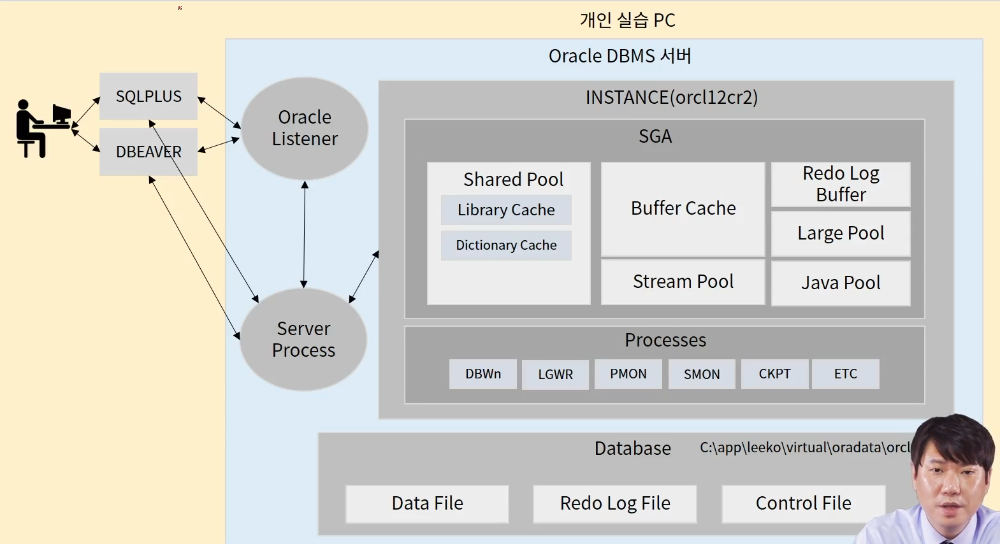

# 오라클 데이터 베이스 설치

## 2 오라클 데이터베이스 접속

## 3 SQLPLUS 활용을 통한 실습 환경 구축

orcle 데이터베이스 자체 툴

```sql
sqlplus system/1234 # 사용자이름/비밀번호
```

실습용 계정 생성 및 권한 주기

- connect : 사용자가 데이터벵스에 접속 가능하도록 하기 위해서 가장 기본적인 시스템 권한 8가지를 묶어 놓음

> alter session, create cluster, create database link, create sequence, create session, create synonym, create table, create view, create session

- resource : 사용자가 객체(테이블, 뷰, 인덱스)를 생성할 수 있도록 하기 위해서 시스템 권한을 묶어 놓음

> create cluster, create procedure, create sequence, create table, create trigger

- dba : 사용자들이 소유한 데이터베이스 객체를 관리하고 사용자들을 작성하고 변경하고 제거할 수 있도록 하는 모든 권한. 시스템 자원을 무제한적으로 사용하며 시스템 관리에 필요한 모든 권한을 부여할 수 있는 강력한 권한을 보유한 롤

```sql
alter session set "_oracle_script"=true;
create user or identified by 1234;
grant connect, resource, dba to ot;
```

테이블 스페이스 생성

```sql
create tablespace ot_data
detafile '{경로지정}' size 1g
autoextend on next 512m maxsize unlimited
logging
online
permanent
extent management local autoallocate
blocksize 8k
segment space management auto
flashback on;
```

 temporary tablespace 생성

- tablespace : 데이터 베이스 오브젝트 내 실제 데이터를 저장하는 공간이다. 데이터 베이스의 물리적인 부분이며, 세그먼트로 관리되는 모든 DBMS에 대해 저장소(세그먼트)를 할당한다. 
- temporary tablespace : 임시 테이블의 저장 및 데이터 정렬시 임시로 사용 

```sql
create temporary tablespace ot_tmp
tempfile '{경로}' size 100m
autoextend on next 100m maxsize unlimited;
```

생성한 계정이 생성한 테이블 스페이스를 사용할 수 있도록

```sql
alter user ot default tablespace ot_data;
alter user ot temporary tablespace ot_tmp;
```

저장한 sql문 sqlplus에서 실행

```sql
sqlplus ot/1234

@{sql 파일 명(.sql 생략 가능)}
```

언어 및 데이트 타입 포맷 설정

```sql
alter session set nls_language='american';
alter session set nls_date_format='DD-MON-RR';
```

## 4 오라클 기본 아키텍처



접속 요청 -> 오라클 리스너 (인증 단계) -> 서버 프로세스 생성 -> sga(버퍼캐시 담당)와 통신

